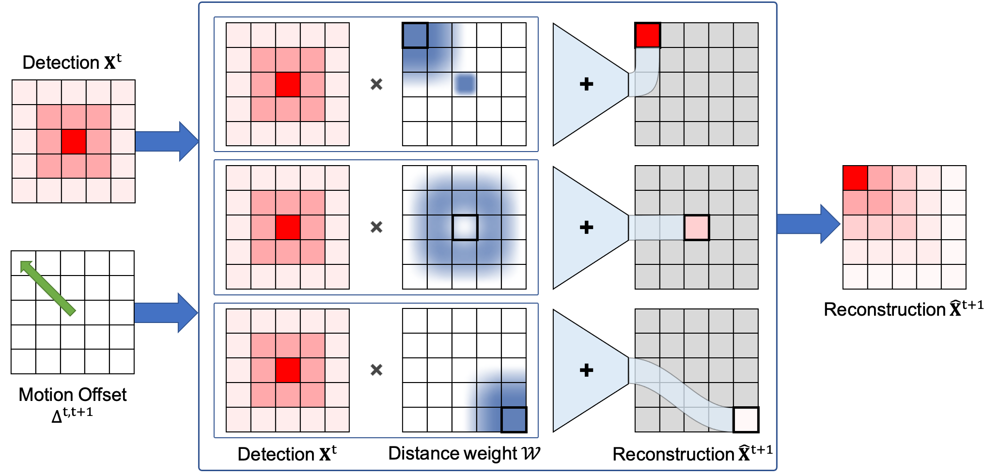

# No Identity, no problem: Motion through detection for people tracking

This repository contains the official implementation of the paper "No Identity, no problem: Motion through detection for people tracking" (To appear in Transactions on Machine Learning Research, November 2024).

## Overview
This work introduces a novel approach for multi-object tracking using motion-guided heatmap reconstruction. The method leverages motion offsets to propagate detection heatmaps across frames, making it possible to learn motion offsets using only detection supervision. Using motion offsets for tracking is particularly beneficial for tracking scenarios with low frame rate.

## Motion-Guided Heatmap Reconstruction

The `reconstruction_from_motion.py` script provides functions to reconstruct heatmaps using motion offsets. This is a core component of our tracking system. This allows to learn motion offsets using only detection supervision.

#### Illustration
Below is an illustration of the reconstruction process:


*The figure shows our differentiable reconstruction process. A detection map at time t and motion offset map are used to reconstruct the detection map at time t+1. Each reconstructed pixel is computed as a weighted sum of previous detections, with weights based on distances between the reconstructed location and expected positions after applying offsets. The example shows three cases: bottom - minimal motion leads to a simple distance-based weighting, middle - object moves away resulting in low weights, top - object moves to this location giving high weights from the offset's starting point.*

#### Usage
To use the [reconstruct_from_motion_offset](reconstruction_from_motion.py) function, you need to provide an input heatmap and optionally a motion offset tensor. The function will return a reconstructed heatmap in a differentiable manner.

```python
import torch
from reconstruction_from_motion import reconstruct_from_motion_offset

# Example usage
heatmap = torch.randn(1, 3, 256, 256)  # Example heatmap
offset = torch.randn(1, 256, 256, 2)   # Example offset
reconstructed_heatmap = reconstruct_from_motion_offset(heatmap, offset)
```

 [](https://colab.research.google.com/github/cvlab-epfl/noid-nopb/blob/main/reconstruction_demo.ipynb)


## Reproducing Results on MOT17

#### Installation
You can install the required packages using the following command:
```bash
pip install -r requirements.txt
```


#### Data preparation
We use the MOT17 dataset for training and evaluation. The dataset should be downloaded from the [MOT17 website](https://motchallenge.net/data/MOT17/). We use the calibration homography provided by [Quo Vadis paper](https://github.com/dendorferpatrick/QuoVadis). 
We are working with detection from YOLOx. Those detection were computed using the pre-trained model provided by the [mmdetection implementation of YOLOx](https://github.com/open-mmlab/mmtracking/tree/master/configs/mot/bytetrack).

More information can be found in the [data/data.md](data/data.md) file.


### Training
To train a model on the MOT17 dataset, use the following command:

```bash
python train.py --train_split --eval_val_split --frame_interval 8 13 -fieval 15 16 --tracker_interval 15 --ground
```

The command above run evaluation at a framerate of 2 FPS and with detection and motion projected onto the ground plane.


### Evaluation
To evaluate a trained model checkpoint, use the following command:

```bash
python test.py checkpoint.pth --frame_skip 15 -tground
```

The `--frame_skip` option allows to skip frames for evaluation (15 results in 2 FPS). The `--track_on_ground` option allows to associate detections based on their groundplane coordinates instead of their 2D coordinates.

## Citation
If you find this work useful in your research, please consider citing:
```
@article{engilberge2024noidnopb,
    title = {No Identity, no problem: Motion through detection for people tracking},
    author = {Martin Engilberge and F. Wilke Grosche and Pascal Fua},
    journal = {Transactions on Machine Learning Research},
    year = {2024}
}
```


## License
This project is licensed under the MIT License. See the [LICENSE](LICENSE) file for details.
